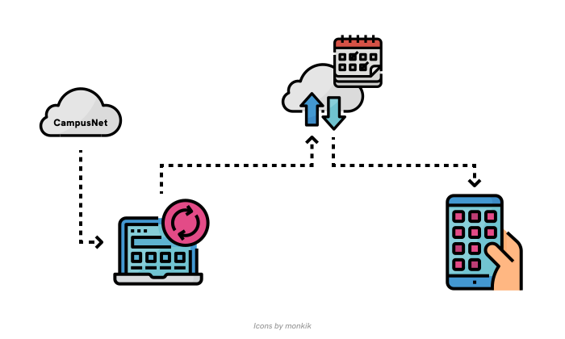
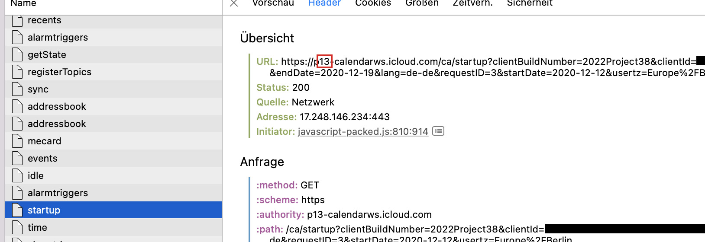
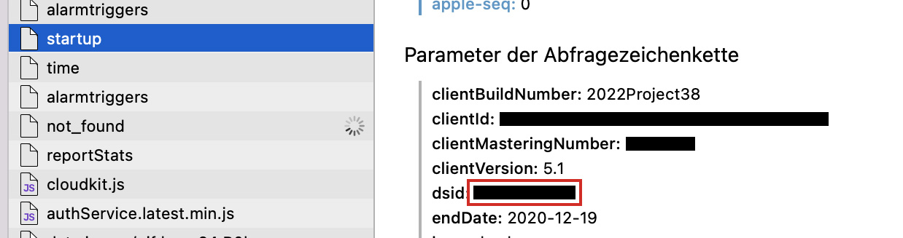
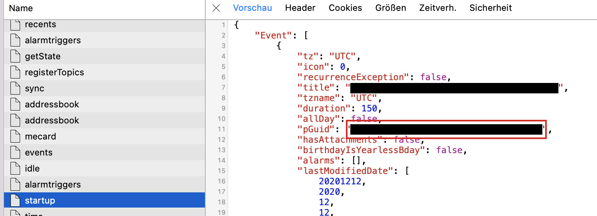

# CampusNet to Calendar
This package synchronises your CampusNet dates to your Apple Calendar for the current and the next month. This package mainly exists because the CampusNet App has a bug where users get logged out regularly and date changes won't update. As this bug probably will not be fixed any time soon, this package will act as an interim solution.

> Note: If you got here by browsing this package is probably not for you. Unless you also want to synchronise dates from a CampusNet to your Apple Calendar, in which case you want to change the URL in lib/cn-scraper.js

- [How it works](#how-it-works)
- [Installation](#installation)
  - [Where to install](#where-to-install)
  - [How to install](#how-to-install)
- [Usage](#usage)
  - [Setup](#setup)
  - [Starting](#starting)
  - [Stopping](#stopping)
  - [Reference](#reference)
- [Contributing](#contributing)

### How it works
When you run the script on your computer, it will check (in the background) twice every day if there were any changes to your CampusNet dates and adjusts them in your cloud calendar. Your calendar app will then fetch the changes and show the correct dates on your phone. Here, I made a figure:  



## Installation
### Where to install
This system will only work if the package runs on a computer that is turned on and online all the time or almost all the time. So, you got a few options:
- run on your laptop / computer (good, when it's used daily in copious amounts)
- run on a Raspberry Pi (recommended)
- run on a server that you already pay for (be cautious as your passwords will be saved on the computer that you set the package up with)

### How to install
Have Node.js installed. Clone / download the repository and run `npm i -g .`.  
To uninstall, run `npm uninstall cn-calendar`.

## Usage
Although this packages does most things of the process automatically, there is a short setup you have to go through to use it properly.
### Setup
Have an iCloud account. Open your console of choice and type `cn-calendar setup`.  
You can create an app specific password by signing in to the [Apple ID account page](https://appleid.apple.com/account/manage). Then under "Security" > "App Specific Passwords" click "Create password..." and follow the steps.  
To get the next three values required go to [https://icloud.com/calendar/](https://icloud.com/calendar/), create a clean calendar ["Edit" -> "+"] and select it. (It is important that this calendar is not used by / for anything but this package.) Open your [developer tools](https://www.stramaxon.com/2013/10/developer-tools-in-browser.html) and go to the network tab (you might have to refresh the page to have all info shown correctly). Locate the entry named "startup" and find the following 3 values:  
1. the two digits after the "https://p" in the URL
   
2. the DSid (located in the parameters of the request) and
   
3. the pGuid (located in the response of the server)
   
### Starting
To start, type `cn-calendar` or `cn-calendar run`.
Use the flag `--once` to run the script once (and not perpetually, twice every day). To see the log for the current process, type `cn-calendar log`. This log is deleted every time you start the package.
### Stopping
To stop, type `cn-calendar stop`.
### Reference
```
usage: cn-calendar [<command>] [<args>]
commands:
    setup [-y]                          prompts all requred values
    run [-q|--quiet] [--once] [-y]      starts the script
    stop                                stops the script
    log                                 prints the log of the current script
options:
    -q, --quiet                         shows only prompts and errors
    --once                              runs the script only once and not on
                                        an interval
    -y                                  confirms all prompts
```

## Contributing
This package currently only works with Apple Calendar. However, not all people use Apple Calendar as their primary calendar. Help to enable them using this package with their favourite calendar app.  
This is the current state:

| Calendar | Supported | Notes |
|---|:---:|---|
| Apple Calendar | ✓ |  |
| Google Calendar |  | Google API not suitable for small projects |
| Microsoft Calendar / Outlook |  |  |
| _others?_ |  |  |

To understand the code and contribute, refer to [contributing.md](contributing.md)
